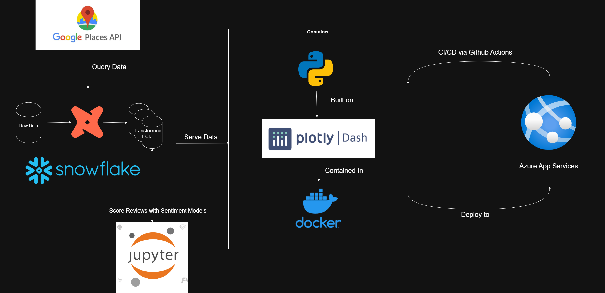
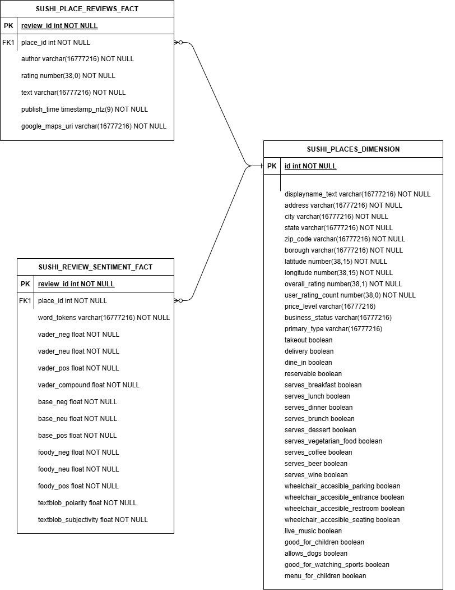
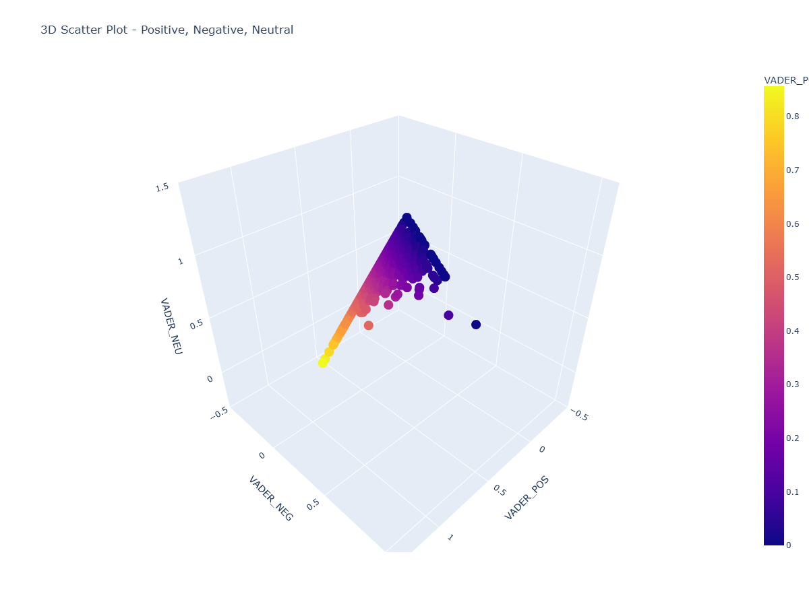
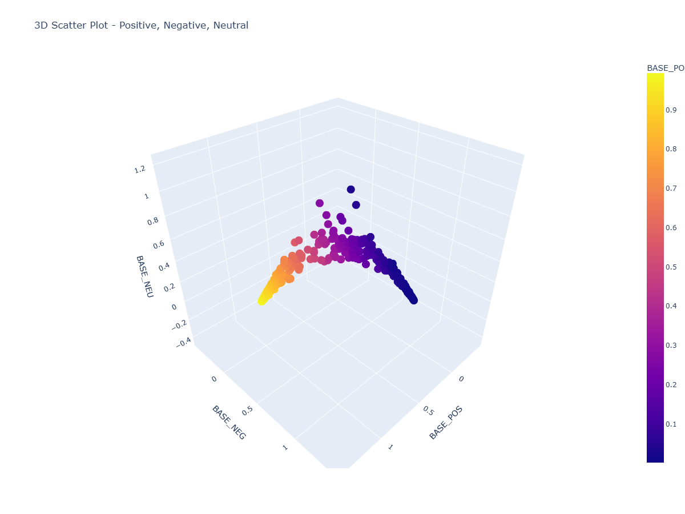

# Sushi in NYC - A Sentiment Analysis

Sentiment Analysis Web Dashboard focused on sushi restaurant reviews in New York City. Sourced from Google Places API, processed and modeled with dbt & Jupyter notebooks, and stored on Snowflake. The web app is then deployed as a docker container hosted on Azure App Services. 

Dashboard Link: https://sushi-nyc-sentiment-app-eng0h9h0h2fkcbb9.eastus2-01.azurewebsites.net/

## Code and Resources Used

**Python Version**: 3.12.9

**Packages**: dash, dash_bootstrap_components, plotly-express, pandas, snowflake-connector, wordcloud, numpy, nltk, re, transformers, scipy, requests

**Technologies**: SQL, Snowflake, DBT, Docker, Git, GitHub Actions, Microsoft Azure

**Data Source**: [Google Places API](https://developers.google.com/maps/documentation/places/web-service/text-search)

## Data Collection

I collected data about sushi restaurants in NYC from the Google Places API, an interface to the data that powers the popular Google Maps service. The Places API provides location data and imagery for establishments, geographic locations, and points of interest through various methods. I specifically used the the Text Search API, which is part of the Places API, to find places using text queries. I constructed my request to the API in a series of queries rather than a singular query like "sushi restaurants in New York City". Rather than the whole city, I queried by borough ("sushi restaurants in Queens", for example), and pulled pages of the response into two consumable dataframes. 

One for the location-related data, *raw_sushi_places*, and another for the reviews for each restaurant, *raw_sushi_reviews*. The dataframes are linked by a unique ID each location is assigned.

## Data Transformation & Feature Extraction

### Snowflake

Snowflake serves as the data warehouse for this application. Snowflake was chosen over other data warehouse services Databricks or a vendor-locked option like Amazon Redshift or Microsoft Azure Synapse Analytics because of its unique architecture that separates compute and storage. This allows for independent scaling, faster performance, and cost-eficiency, along with a fully managed, cloud-native approach.

Snowflake's capabilities also allows for further development of the data pipeline of the project, such as adding Snowpark Python UDFs, Python stored procedures, and tasks to facilitate and enhance data cleaning/processing.

### DBT

The raw data collected from the Google Places API is stored in Snowflake and is considered the *staging layer* in the the dbt lineage. It is then transformed in the *standardization layer* to a format where the restaurant's address is broken up into interpretable parts, like street address, city, borough, and zip code. The standardized table, *std_sushi_places*, is then used in conjunction with the raw data to generate the facts and dimensions in the *presentation layer*. These tables are named *sushi_places_dimension* and *sushi_place_reviews_fact*. The table that contains sentiment metrics of the reviews based on the text, *sushi_review_sentiment_fact*, is produced in a Jupyter notebook.

### Sentiment Models

The major feature of this application is to analyze a sushi restaurant through the sentiment of its reviews. This is valuable for not only informing on if a restaurant is performing well but to get a more intimate, on-the-ground insight of what the restaurant is like. For this, we utilize popular sentiment models like NLTK's VADER Sentiment Analysis and HuggingFace's RoBERTa Transformer models. The outputs of these models when ran on our review data make up the fields of the *sushi_review_sentiment_fact* table.

#### NLTK VADER

VADER, or Valence Aware Dictionary and sEntiment Reasoner, is a lexicon and rule-based sentiment analysis tool that is specifically attuned to sentiments expressed in social media, and works well on texts from other domains. Being a rule-based model that uses a preset lexicon however, the model can fail to recognize sarcasm or context in language.

#### HuggingFace Transformers: RoBERTa

RoBERTa, which stands for Robustly Optimized BERT Pretraining Approach, is a powerful machine learning model pre-trained on a large corupus of text for NLP tasks. Specifically, its a variant of BERT, a neural network architecture designed for understanding the context of words in text. RoBERTa is optimized for improved performance and efficiency in various NLP tasks.

## Plotly Dash

Plotly Dash is a Python framework that allows data professionals to publish dashboards or other interfaces in the form of web applications so that stakeholders can access the data. In the realm of sentiment analysis, Plotly Dash also offers more options and flexibility in visualizing and communicating insights compared to proprietary reporting tools like Tableau and Power BI. Besides the front-end capabilities, Plotly Dash allows for connection to SQL based databases like Snowflake, which is only possible in Tableau for example when one purchases it.

## CI/CD Deployment: Docker & Azure App Services

To make deployment & maintenance easier and implement CI/CD (Continuous Integration, Continuous Deployment) pracetices, I deployed my app in a docker container. Docker is an open-source platform that enables developers to package applications and their dependencies into containers, allowing them to be deployed and run consistently across different environments. Because of containerization, the app is server agnostic, which would make migration easier if it is needed, and can horizontally scale, meaning more instances of the app can be created if usage increases. Azure App Services offers these settings and be set to do so dynamically.

GitHub Actions plays a role as well, facilitating deployment of containerized apps while hosting your code at the same time. GitHub Actions is a CI/CD (Continuous Integration/Continuous Delivery) platform that allows you to automate your software development workflows, including building, testing, and deploying your applications directly from your GitHub repository. GitHub Actions knows how to construct a workflow by reading the YAML file at the root of the app directory. The workflow is a sequence of automated tasks that can be configured to run in response to code pushes, pulls, or issues through the YAML file. YAML files are a powerful feature CI/CD development because they allow for automated testing and configuration depending on repository events or changes in team priorities.

## Future Improvements

The design choices I've laid out above are essential to the continuous improvement of the sushi dashboard. This application has potential for integrating Machine Learning and AI capabilities to enhance the user experience and refine the insights further. Not to mention other data that can be made accessible in a future update.

Planed Improvements include:

#### Data Orchestration:
- Use an orchestration tool like Prefect or Airflow to automate data refreshes from the GP (Google Places) API to the Snowflake warehouse, updating current records and adding new ones.

#### Front End
- Cotinuing improving user experience
    - Organizing dashboard layout for easier navigation.
    - Refining visuals to be more informative and communicative to the nontechnial user.
    - Add more information bubbles that users can hover for useful details on what they are seeing or how to use the application.

#### Machine Learning:
- Add a page where users can compare different regression models that predict the overall rating (target variable) of a restaurant based off features from the GP API data Delivery.
    - Purpose of these models would be to answer the question, "Based on data that Google collects, what makes a good sushi restaurant?"
- Build homemade sentiment model using features surrounding review text and rating as the target variable.
- Replace "Foody Bert" model with latest Twitter RoBERTa model for comparison with older version.

#### AI:
- Integrate openai or other AI service into app to allow for AI-informed insights based off data from the Snowflake data warehouse.
    - Such insights would be heavily customizable by the user since the user can prompt exactly what they'd like to know from the AI.
